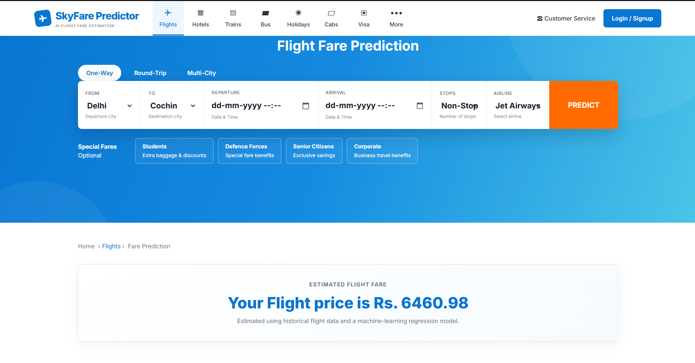

# ✈️ SkyFare Predictor

An end-to-end Machine Learning web application that predicts flight ticket prices using **Random Forest Regression**. The application allows users to enter flight details through a clean web interface and instantly predicts the estimated airfare.

---

## 🌐 Live Demo

🚀 https://skyfare-predictor.onrender.com

---

## 📸 Preview



---

# ✨ Features

- Predict flight ticket prices instantly
- User-friendly Flask web interface
- Random Forest Regression model
- Feature Engineering & Data Preprocessing
- Responsive UI
- Deployed on Render
- Real-time predictions

---

# 🛠️ Tech Stack

### Machine Learning
- Python
- Pandas
- NumPy
- Scikit-learn

### Backend
- Flask
- Gunicorn

### Frontend
- HTML
- CSS

### Visualization
- Matplotlib
- Seaborn

### Deployment
- Render

---

# 📂 Project Structure

```
SkyFare-Predictor/
│
├── Flight Fare/
│   ├── Data_Train.xlsx
│   ├── Test_set.xlsx
│   └── Sample_submission.xlsx
│
├── images/
│   └── preview.png
│
├── static/
│   └── css/
│       └── styles.css
│
├── templates/
│   └── home.html
│
├── app.py
├── flight_price.ipynb
├── flight_rf.pkl
├── requirements.txt
├── Procfile
├── .python-version
├── README.md
└── LICENSE
```

---

# 📊 Dataset

The model is trained using historical Indian flight fare data.

### Features

- Airline
- Date of Journey
- Source
- Destination
- Route
- Total Stops
- Duration
- Additional Information

### Target

- Price

Dataset files are available inside the **Flight Fare** folder.

---

# 🤖 Machine Learning Workflow

- Data Cleaning
- Handling Missing Values
- Feature Engineering
- Label Encoding
- Model Training
- Random Forest Regression
- Model Evaluation
- Model Serialization using Pickle
- Flask Deployment

---

# 📈 Model

**Algorithm Used**

- Random Forest Regressor

The trained model is stored as:

```
flight_rf.pkl
```

---

# 🚀 Installation

Clone the repository

```bash
git clone https://github.com/ayushhmishhra/SkyFare-Predictor.git
```

Move into the project directory

```bash
cd SkyFare-Predictor
```

Install dependencies

```bash
pip install -r requirements.txt
```

Run the application

```bash
python app.py
```

Open your browser

```
http://127.0.0.1:5000
```

---

# 🧪 Example Prediction

### Input

- Source : Delhi
- Destination : Cochin
- Airline : Jet Airways
- Stops : Non-Stop

### Output

```
Predicted Fare : ₹6697.60
```

---

# 🔮 Future Improvements

- Live Flight API Integration
- Airline Price Trend Analysis
- Model Explainability
- Docker Deployment
- Cloud Database Support
- User Authentication
- Dark Mode UI

---

# 👨‍💻 Author

**Ayush Mishra**

GitHub

https://github.com/ayushhmishhra

---

# 📄 License

This project is licensed under the MIT License.

---

⭐ If you found this project useful, don't forget to **Star** the repository.